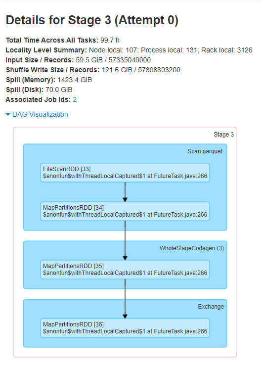
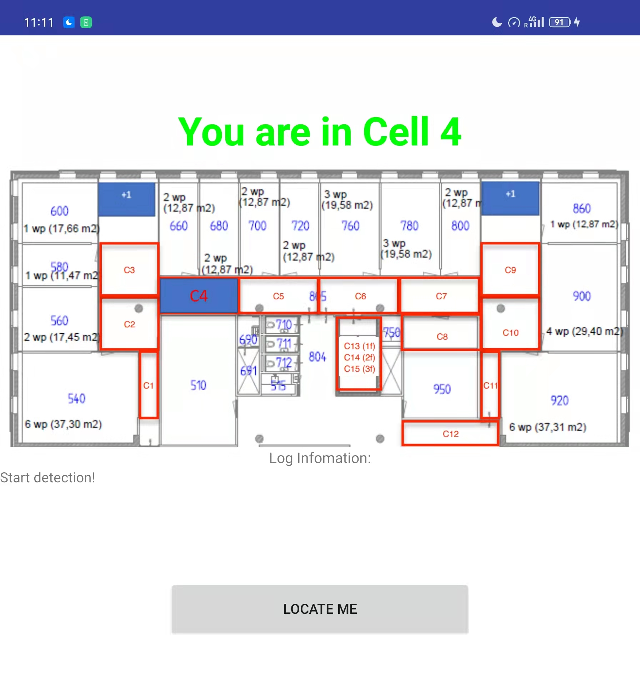
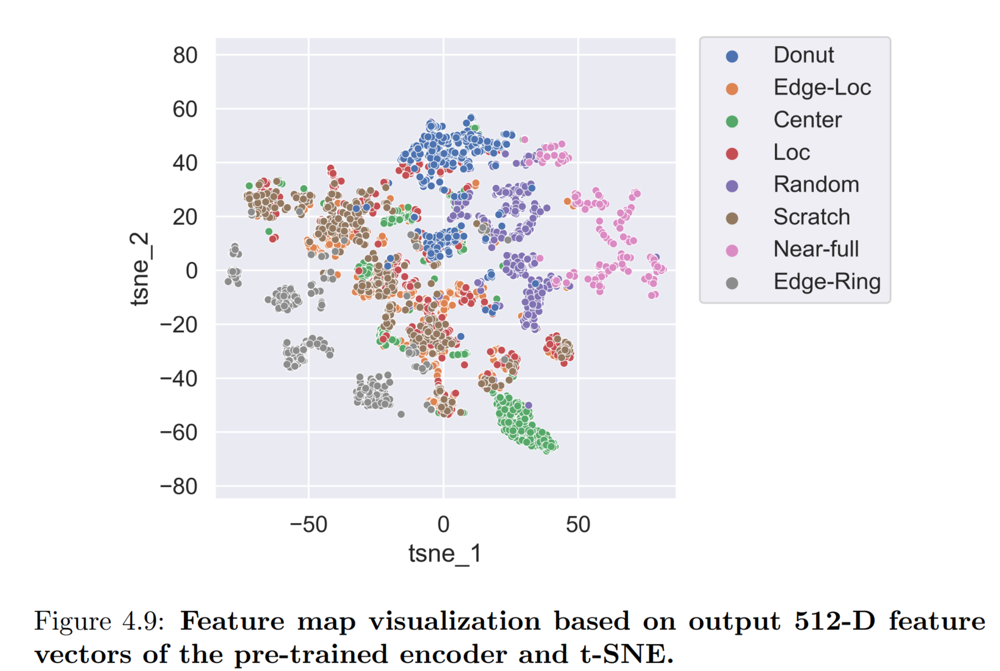
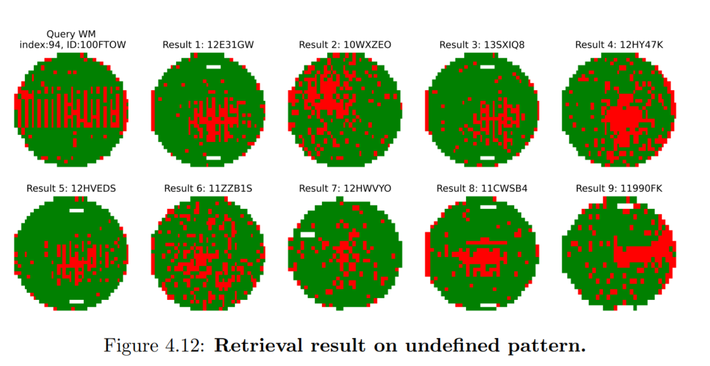

## Large scale data process with Apache Spark and AWS

Developed an application to process the OpenStreetMap and ALOS Global Digital Surface Model data sets (on TB scale) to generate insight in predicting the consequences of global sea level rising. 

## Indoor Localization Android applications

Developed 2 Android applications for indoor localization and activity detection:

• The first application is built on a statistical model with Wi-Fi signal strength distribution data from multiple access points to enable localization by matching with current input data
• The second application collected and processed data from the gyroscope and accelerometer to detect the user’s direction and current activity. Plus it can detect whether the user is moving upstairs or downstairs based on Google location service API

## Thesis project: Unsupervised Wafer Map Failure Pattern Recognition with Contrastive Learning

In this project, my goal is:

1. To prove that by employing **Self-Supervised Contrastive Learning (SSCL)**, we can maximize the utility of the vast amount of unlabeled wafer test data for various downstream tasks. And we can improve the quality of representation learning for **Wafer Map Failure Pattern Recognition(WMFPR)** by adapting optimal configuration for the SSCL model.
2.  To demonstrate how the proposed method can improve the production quality and overall yield. And to give insight on how can we apply the extracted features to help engineers identify similar issues.

   
If file does not load below, click [THIS LINK](https://kevin-zx-liu.github.io/files/masters_thesis.pdf) to download.

<embed src="{{ site.baseurl }}/files/masters_thesis.pdf" width="650" height="800" type='application/pdf'>